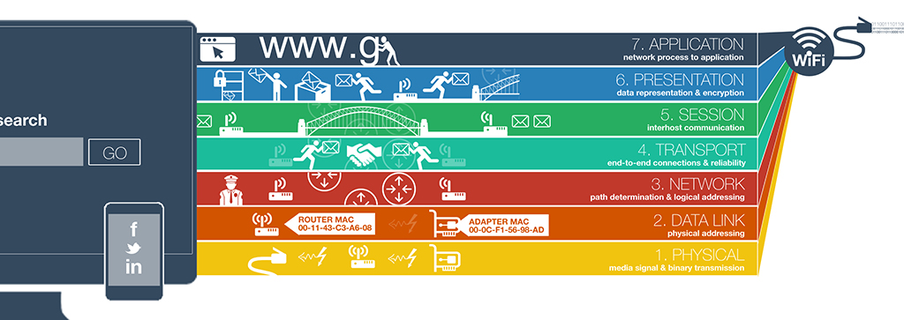
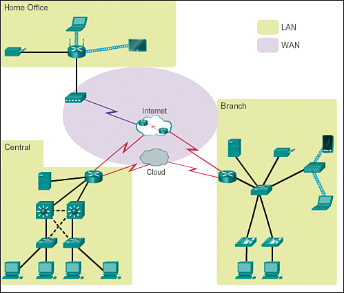
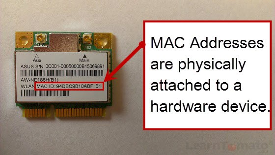
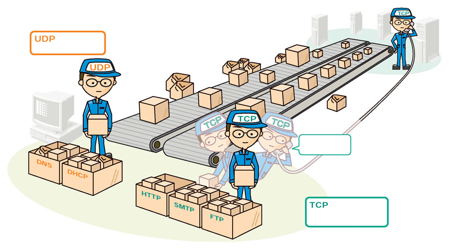

# Concept: 0x07. Networking Basics #0

**#DevOps** **#Network**

## Resources

**Read or watch:**

- [OSI model](https://en.wikipedia.org/wiki/OSI_model)
- [Different types of network](https://www.lifewire.com/lans-wans-and-other-area-networks-817376)
- [LAN network](https://en.wikipedia.org/wiki/Local_area_network)
- [WAN network](https://en.wikipedia.org/wiki/Wide_area_network)
- [Internet](https://en.wikipedia.org/wiki/Internet)
- [MAC address](https://whatismyipaddress.com/mac-address)
- [What is an IP address](https://www.bleepingcomputer.com/tutorials/ip-addresses-explained/)
- [Private and public address](https://www.iplocation.net/public-vs-private-ip-address)
- [IPv4 and IPv6](https://www.webopedia.com/insights/ipv6-ipv4-difference/)
- [Localhost](https://en.wikipedia.org/wiki/Localhost)
- [TCP and UDP](https://www.howtogeek.com/190014/htg-explains-what-is-the-difference-between-tcp-and-udp/)
- [TCP/UDP ports List](https://en.wikipedia.org/wiki/List_of_TCP_and_UDP_port_numbers)
- [What is ping /ICMP](https://en.wikipedia.org/wiki/Ping_%28networking_utility%29)
- [Positional parameters](https://wiki.bash-hackers.org/scripting/posparams)

**man or help:**

- `netstat`
- `ping`

## Learning Objectives

### OSI Model

- What it is
- How many layers it has
- How it is organized

### What is a LAN

- Typical usage
- Typical geographical size

### What is a WAN

- Typical usage
- Typical geographical size

### What is the Internet

- What is an IP address
- What are the 2 types of IP address
- What is `localhost`
- What is a subnet
- Why IPv6 was created

### TCP/UDP

- What are the 2 mainly used data transfer protocols for IP (transfer level on the OSI schema)
- What is the main difference between TCP and UDP
- What is a port
- Memorize SSH, HTTP, and HTTPS port numbers
- What tool/protocol is often used to check if a device is connected to a network

